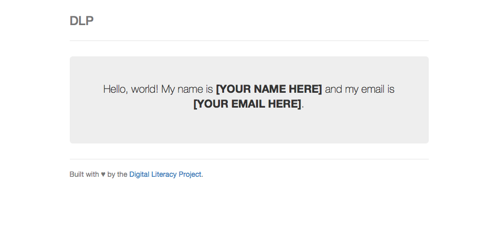

# DLP TTP Comp
## Mini-project
Interested in getting started with the comp? Here's a small project where you'll:
- Set up your development environment for web development with Node.js
- Get familiar with Git, the collaboration software we'll use for our projects
- Learn how to use the [Atom](https://atom.io) text editor

And, of course, by completing the project, you'll be entered into the comp!

### Setting up
First, let's get your development environment set up. Open up this [Mac Dev Setup guide](https://github.com/nicolashery/mac-dev-setup). Do the following steps:
- [iTerm2](https://github.com/nicolashery/mac-dev-setup#iterm2)
- [Homebrew](https://github.com/nicolashery/mac-dev-setup#homebrew)
- [Git](https://github.com/nicolashery/mac-dev-setup#git)
- [Node.js](https://github.com/nicolashery/mac-dev-setup#nodejs)

Feel free to do other steps as well!

That'll get you some of the core tools you'll need for web development, including Git and Node.js. But we'll need a few more ones; run the following in your terminal:

```sh
npm install -g yo bower gulp
```

Grab a copy of the [Atom](http://atom.io/) text editor. It's similar to the famous Sublime Text, but it's very well-suited for web development and has a huge and fast-growing plugin community. I highly recommend it and will be using it for the purposes of this comp.

### Getting started with Git
Now you'll learn how to use Git and GitHub. If you aren't already familiar with Git, try this [this interactive Git tutorial](https://try.github.io).

#### Getting the repo
We've created a [sample GitHub repository](https://github.com/hathix/dlp-webapp) for a simple frontend web app. Open up that repository and get acquainted with various pages and features of a GitHub repository:
- Pull requests
- Issues
- File browser

Now make your own copy of the repository (or "repo") so you can work with it. [This forking and cloning tutorial](https://help.github.com/articles/fork-a-repo/#keep-your-fork-synced) will be helpful; do everything up to but not including "Step 3: Configure Git to sync your fork..."

On our repo's homepage, use the _Fork_ button to "fork" our repo, making your own version of it that you can work with.

Now you need to get your own repo on your computer so you can actually edit it. Find the HTTPS clone URL on your repo's page; it should be something like `https://github.com/<YOUR_USERNAME>/dlp-comp.git`.

 Then run:

```sh
git clone <URL>
```

to get your repo on your machine.

#### Running the app
Now that you have your copy of the repo, let's get it up and running:

```sh
npm install
bower install
gulp serve
```

Upon entering that last command, a very simple webpage like the below will open in a browser; that's you app!



You should also see terminal output that looks something like this:

```sh
Fresh-Prince:dlp-webapp neel$ gulp serve
[11:23:39] Requiring external module babel-core/register
[11:23:40] Using gulpfile ~/Documents/Git/dlp-webapp/gulpfile.babel.js
[11:23:40] Starting 'styles'...
[11:23:40] Starting 'scripts'...
[11:23:40] Starting 'fonts'...
[11:23:42] Finished 'styles' after 2.27 s
[11:23:42] Finished 'fonts' after 1.65 s
[11:23:42] Finished 'scripts' after 1.74 s
[11:23:42] Starting 'serve'...
[11:23:42] Finished 'serve' after 91 ms
[BS] Access URLs:
 --------------------------------------
       Local: http://localhost:9000
    External: http://10.252.141.93:9000
 --------------------------------------
          UI: http://localhost:3001
 UI External: http://10.252.141.93:3001
 --------------------------------------
[BS] Serving files from: .tmp
[BS] Serving files from: app
```

If something goes wrong, you might have missed a prior step. Go back and try again!

#### Editing your app
The app looks good, but, as you might imagine, you need to insert your name!

Open up your app in Atom:

```sh
atom .
```

You'll see a file browser on the left and a file editing pane in the center of the window. Pretty standard interface for a text editor! If you've ever used Sublime Text, Atom is pretty similar.

Let's edit `index.html`, the main page of the app. That file might be buried within several folders, so you can use the Fuzzy File Finder to find it. Hit `Cmd+T` and search for `index.html`; hit Enter once you've found what you're looking for and it'll be opened up in the file editor.

There's a lot of code in `index.html`, but find this snippet:

```html
<p class="lead">
    Hello, world! My name is
    <strong>[YOUR NAME HERE]</strong> and my email is
    <strong>[YOUR EMAIL HERE]</strong>.
</p>
```

This is good ol' HTML that you've learned about! Insert your name and email, then save the file and reload the webpage. You should see this new information on the page!

#### Submitting
You're done your (very brief) coding part of the project! Now it's time to submit your project and be officially entered into the comp.

First, add, commit, and push your changes to GitHub:

```sh
git add -A
git commit -m "Added my name"
git push
```

You might need to enter your GitHub username and password at some point here.

Now return to your repo's GitHub page. You should see your latest commit message, "Added my name", and you should see that your repo is one commit ahead of the master branch.

To officially submit, [follow this guide to create a pull request](https://help.github.com/articles/using-pull-requests/).

### You're done!
Once you've submitted your pull request, you're done the mini-project! You can await an email from us welcoming you to the comp.
